# mpp
Modern Programming Practices

## UML: Types of UML relationships

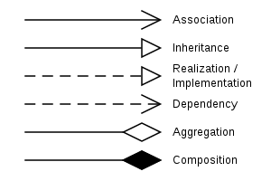

### At the instance level

- **Dependency**  
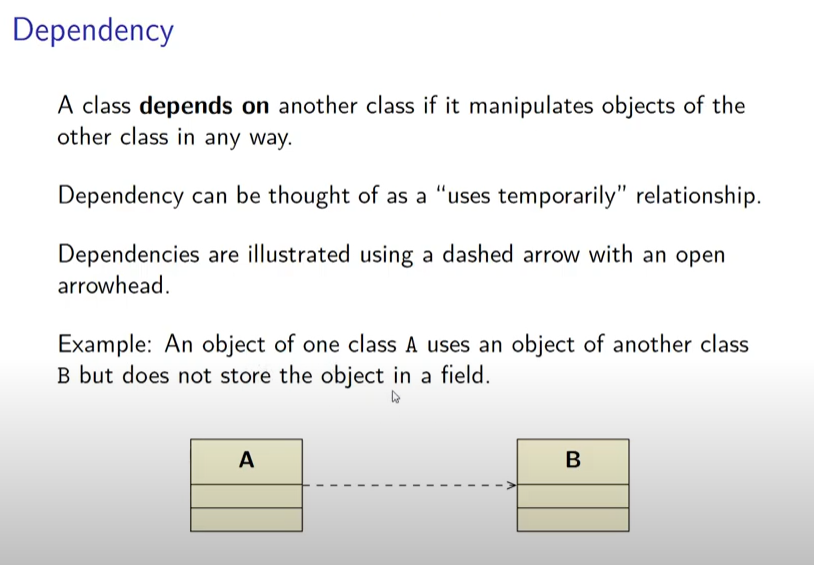
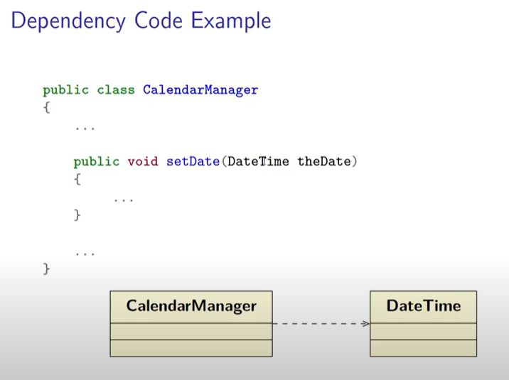

- **Association**  
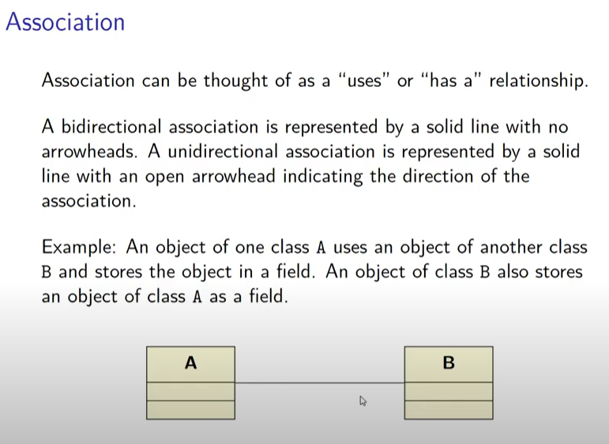

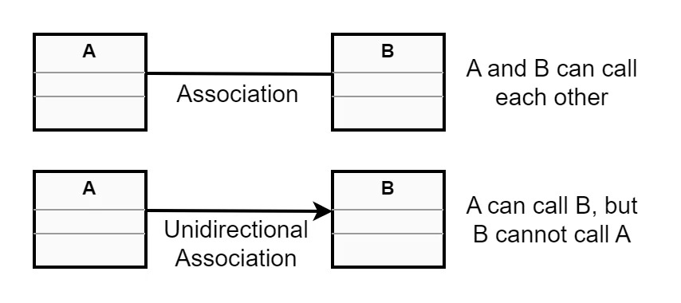
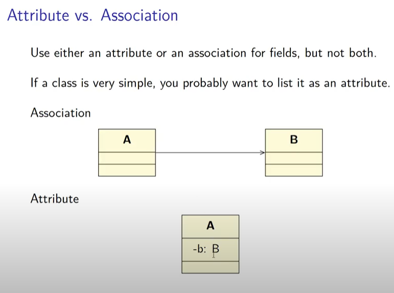

- **Aggregation**  
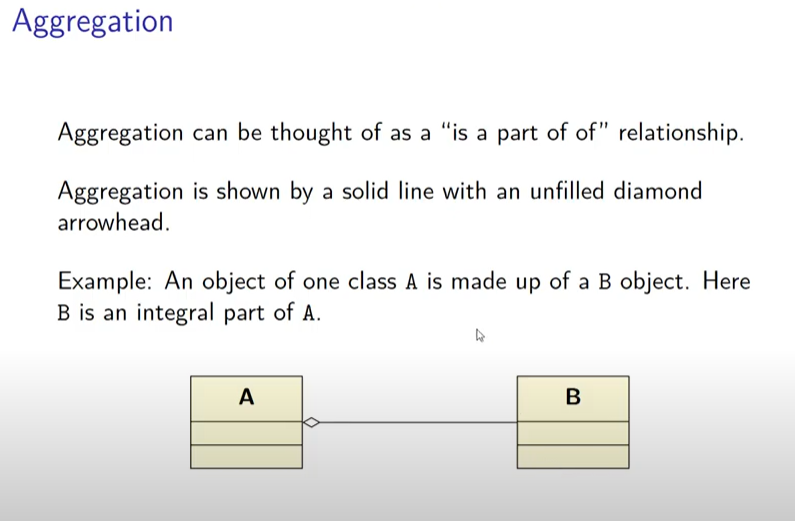  
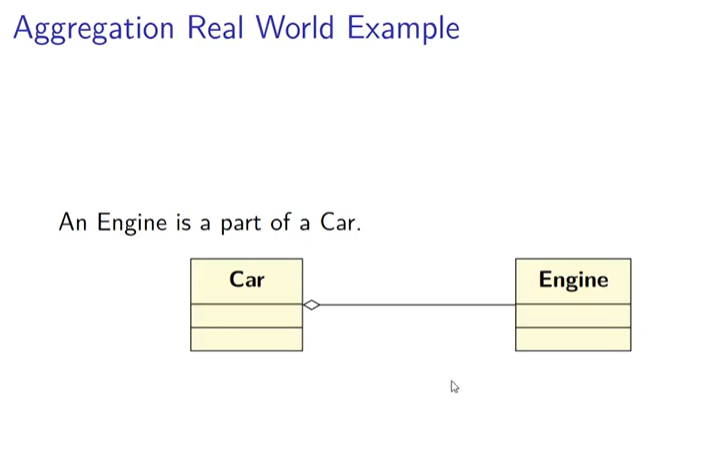  
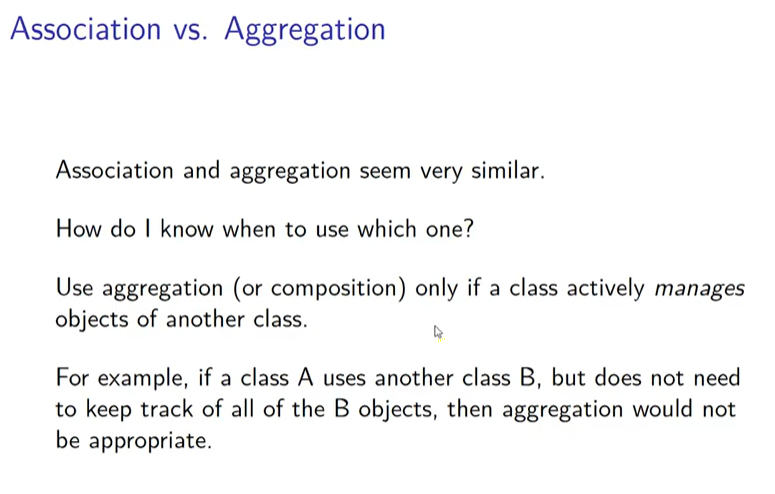  

- **Composition**  
  
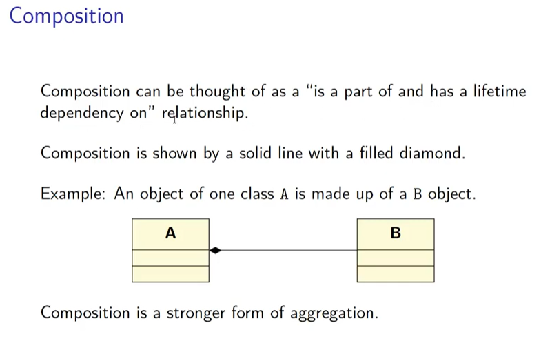   
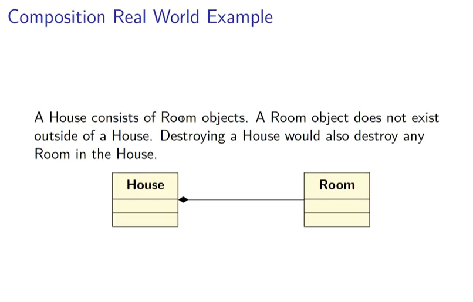   

Aggregation: Child can live without the parent, but parent cannot live without the child, Car: Engine
Composition: Child cannot live without the parent, and the parent cannot live without the child, House: Room

---

### At the class level

- **Inheritance**  
  A class inherits from another.  
  *Notation:* Blank arrow to the class from which it inherits.  

- **Implementation**  
  The class implements from the interface.  

- **Dependency**  
  The class is dependent on the other.  
  *Notation:* Open arrow  

### Multiplicity
0 or 1 and not Zero more more
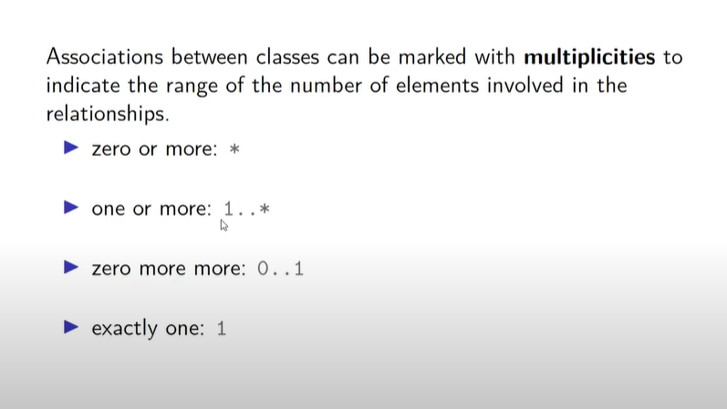