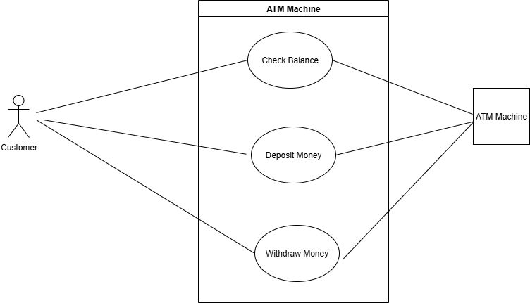
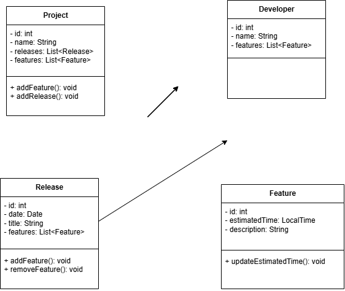

*Student Name:* **John Okon Ansa**

*Student ID:* **619952**

# Lab 1

- [Problem 1](#problem-1)  
- [Problem 2](#problem-2)  

## Problem 1

|**User Action**| **System Response** |
|--|--|
| User types in PIN into main screen | System checks validity of PIN and presents options to user on another screen |
|  User selects Withdraw option | System displays a screen prompting the user to enter the withdrawal amount |
| User enters the withdrawal amount | System verifies sufficient funds in the account and prompts the user to confirm the amount |
| User confirms the withdrawal amount | User confirms the withdrawal amount System dispenses the requested cash and print receipt |
| User takes cash and a receipt | System displays a transaction completion message and returns to the main screen |

## Problem 2

## Problem 3

*Note:* The id and name attributes were not explicitly mentioned, but included sine the objects generated from the classes needs to be uniquely identified throug their ids.